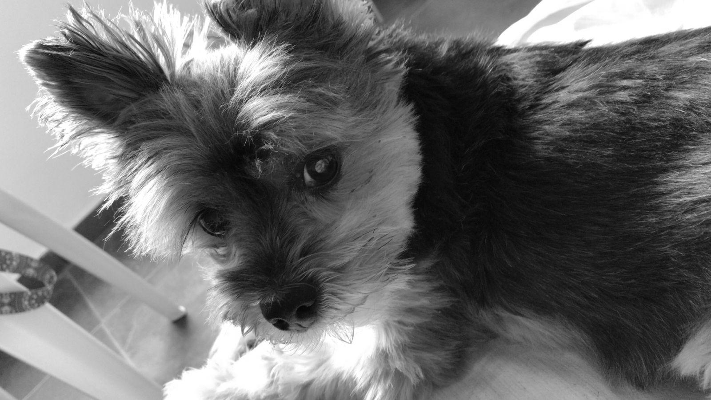
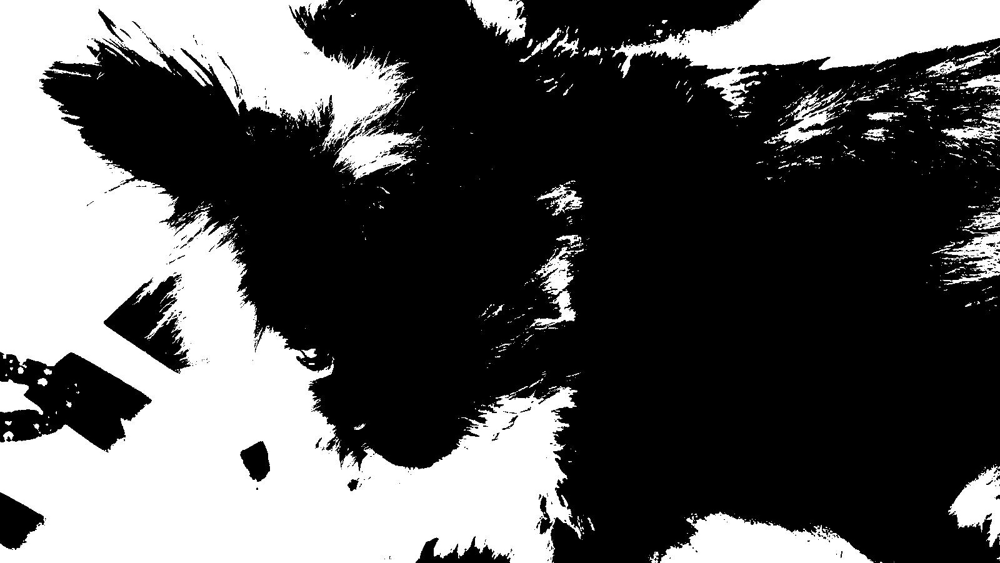

# Redução de Dimensionalidade em Imagens para Redes Neurais

O objetivo do projeto consistia em transformar uma imagem colorida em cinza e binarizada utilizando a linguagem Python.

## Imagem original

## Resultado

